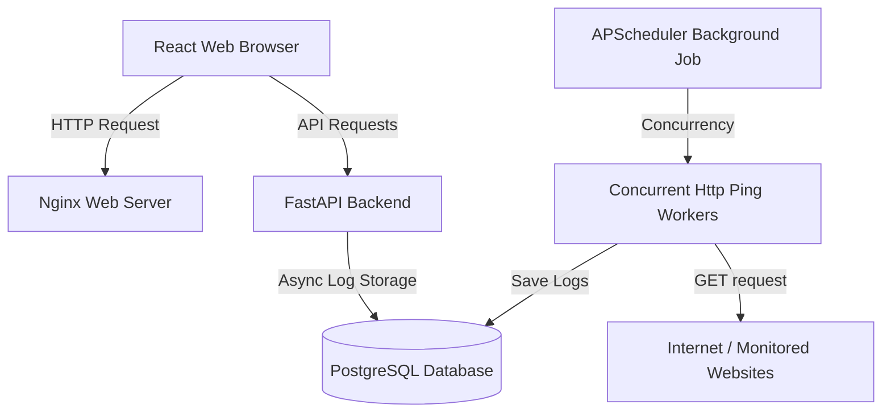

# Uptime Monitor - Production-Ready Dashboard

A lightweight, high-performance web dashboard that monitors website liveness, availability, and response times in real time. Built using FastAPI, SQLAlchemy, React (Vite), and Docker, it represents a simple yet polished MVP for server metrics tracking.

---

## 1. Project Overview

The Uptime Monitor tracks the availability of registered URL endpoints. A background task runs concurrent ping checks every minute, saving latency and status logs to a PostgreSQL database. The dashboard automatically polls for changes and renders key metrics, history logs, search, sorting, and sparklines.



---

## 2. Features

* **Real-Time Summary Cards**: Instant count of monitored, healthy, and down services, along with average latency computations.
* **Response Time Sparklines**: Minimalist inline line charts rendering latency trends for the last 10 checks using Recharts.
* **Health Check History Dialog**: Deep-dive logs overlay tracking timestamp, status codes, and network error logs.
* **Instant Manual Checks**: Immediate "Check Now" triggers that ping selected endpoints out-of-band and update metrics.
* **Frontend Filtering & Sorting**: Dynamic search matching URLs/names and sorting by URL, Status, Latency, and Checked time.
* **Shimmer Skeletons & Empty States**: Polished user interfaces during initial loads and when no monitors are registered.
* **URL Structure Verification**: Domain and scheme checks on both frontend and backend to reject invalid URLs.
* **FastAPI Swagger Documentation**: Fully typed and documented API schemas and system probes.
* **Docker Container Stack**: Single-command orchestration for simple setup.

---

## 3. Technologies Used

* **Backend**: FastAPI (Python 3.12/3.13), SQLAlchemy 2.0 (Async Engine), PostgreSQL 16, APScheduler, HTTPX.
* **Frontend**: React 19, Vite 8, Recharts (Sparkline visualization), Axios.
* **Testing & CI**: Pytest, Pytest-Asyncio, Aiosqlite, GitHub Actions.
* **Hosting/Proxy**: Nginx (serving React build assets), Docker Compose.

---

## 4. Folder Structure

```
tetrix/
├── .github/
│   └── workflows/
│       └── ci.yml             # Github Actions lint & test workflow
├── backend/
│   ├── app/
│   │   ├── services/
│   │   │   ├── __init__.py
│   │   │   └── monitor.py     # Health checks ping orchestrator
│   │   ├── __init__.py
│   │   ├── config.py          # Pydantic Settings env loader
│   │   ├── db.py              # Async SQLAlchemy connection
│   │   ├── main.py            # Lifespan manager, DoH monkeypatch
│   │   ├── models.py          # SQLAlchemy ORM Tables mapping
│   │   ├── router.py          # REST Endpoints
│   │   └── schemas.py         # Pydantic schemas (validations)
│   ├── tests/
│   │   ├── conftest.py        # SQLite async testing client fixtures
│   │   └── test_endpoints.py  # Backend endpoint tests
│   ├── Dockerfile
│   ├── pytest.ini             # Pytest-asyncio loop configuration
│   └── requirements.txt
├── frontend/
│   ├── src/
│   │   ├── components/
│   │   │   ├── AddUrlForm.jsx # Registration form
│   │   │   ├── ErrorAlert.jsx # Floating warning banner
│   │   │   ├── HistoryModal.jsx # Overlay history tables
│   │   │   ├── SummaryCards.jsx # Core KPI metrics cards
│   │   │   └── UrlsTable.jsx  # Primary interactive monitors list
│   │   ├── hooks/
│   │   │   └── useInterval.js
│   │   ├── services/
│   │   │   └── api.js         # HTTP Client
│   │   ├── App.jsx            # State dashboard coordinator
│   │   ├── index.css          # Design system & Animations
│   │   └── main.jsx
│   ├── Dockerfile
│   ├── nginx.conf
│   └── package.json
├── docker-compose.yml
├── .env.example
└── .env
```

---

## 5. REST API Overview

* **`GET /health`**: Live system liveness checks. Returns `{"status": "ok"}`.
* **`POST /urls`**: Register a new URL monitor.
* **`GET /urls`**: Fetch all registered monitors alongside latest health stats and last 10 response times.
* **`DELETE /urls/{id}`**: Unregister a URL and delete check logs.
* **`GET /history/{id}`**: Fetch up to 100 recent health check logs for a specific URL.
* **`POST /urls/{id}/check`**: Run an immediate out-of-band health check and return the result.

Access the interactive API docs at **`http://localhost:8000/docs`** (Swagger) or `/redoc` while the backend container is running.

---

## 6. Setup and Installation

### Prerequisites
* [Docker Desktop](https://www.docker.com/products/docker-desktop/) installed and running.

### Booting the Application
1. In the root directory, create a `.env` file from the example:
   ```bash
   cp .env.example .env
   ```
2. Build and launch the container services:
   ```bash
   docker compose up --build
   ```
3. Open your browser and navigate to:
   * **Dashboard UI**: `http://localhost`
   * **API Docs**: `http://localhost:8000/docs`

---

## 7. Verification Steps

### Automated Tests
Run the backend unit tests locally using pytest:
```bash
cd backend
python3 -m pip install -r requirements.txt pytest pytest-asyncio aiosqlite
python3 -m pytest tests
```

### Manual Testing Scenarios

1. **Verify Skeletons**: On initial load or hard reload, watch for the shimmering skeleton rows before the data is populated.
2. **Add Healthy URL**: Register `https://github.com` with the name `GitHub`. Confirm it shows `UP` with latency.
3. **Verify Summary Cards**: Ensure the Total count is `1`, Healthy is `1`, Down is `0`, and Average Latency matches the site.
4. **Trigger Manual Check**: Click **Check Now** for GitHub. Observe the status transitions to `🟡 Checking` and updates with fresh latency.
5. **View History**: Click **History** or the site's name. A modal showing the run log list should display newest checks first.
6. **Add Broken URL**: Register `https://thisdomainisinvalid12345.com`. Verify it goes `DOWN`, increases the Down summary card, and lists network logs in History.
7. **Filter List**: Type `github` in the search box; confirm the list filters instantly.
8. **Sort Columns**: Click headers like "Latest Latency" or "Last Checked" to toggle sorting order.

---

## 8. Deployment Sketch

```
                        ┌───────────────────┐
                        │  Users / Clients  │
                        └─────────┬─────────┘
                                  │ HTTPS
                                  ▼
                        ┌───────────────────┐
                        │  Amazon Route 53  │
                        └─────────┬─────────┘
                                  │
                  ┌───────────────┴───────────────┐
                  │ CloudFront (CDN)              │ ALB Route
                  ▼                               ▼
        ┌──────────────────┐            ┌──────────────────┐
        │    Amazon S3     │            │  Application     │
        │ (Static Web App) │            │  Load Balancer   │
        └──────────────────┘            └────────┬─────────┘
                                                 │
                                                 ▼
                                        ┌──────────────────┐
                                        │   AWS ECS Fargate│
                                        │  FastAPI Tasks   │
                                        └────────┬─────────┘
                                                 │ VPC Security Group
                                                 ▼
                                        ┌──────────────────┐
                                        │  Amazon RDS PG   │
                                        └──────────────────┘
```

1. **Frontend**: Build production assets with `npm run build` and upload them to an **Amazon S3** bucket. Put **AWS CloudFront** in front of S3 for SSL, global caching, and low latency.
2. **Backend**: Host the backend Docker container on **AWS ECS Fargate** behind an **Application Load Balancer (ALB)** for auto-scaling and traffic routing.
3. **Database**: Store metrics inside **Amazon RDS for PostgreSQL** inside a private subnet.

---

## 9. Future Improvements

* **Email & Slack Alert Notifications**: Send webhook/mail triggers when a URL changes status from UP to DOWN.
* **Custom Polling Intervals**: Allow configuring the cron frequency (e.g. every 5m, 1h) per URL.
* **Pagination**: Implement cursor-based pagination for history logs.
